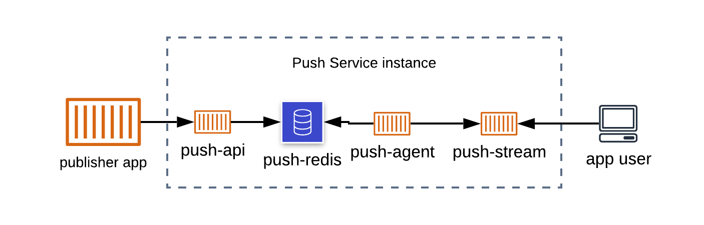
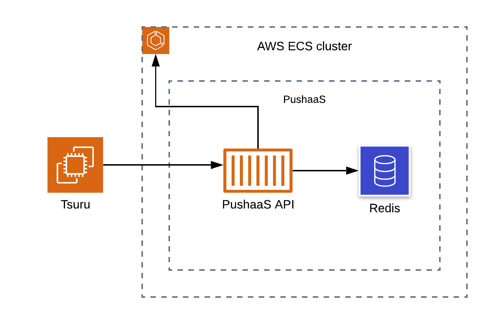
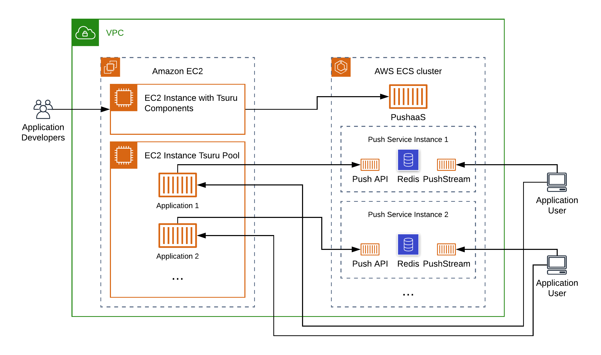

  

# PushaaS docs

[PushaaS](https://github.com/pushaas) is a project that aims to offer [server-push](https://en.wikipedia.org/wiki/Push_technology) functionality as a [service](https://docs.tsuru.io/stable/services/index.html) for the [Tsuru](https://tsuru.io/) PaaS, based on tools built around the [Push Stream](https://www.nginx.com/resources/wiki/modules/push_stream/) module for [Nginx](https://www.nginx.com/).

The system that implements the [Push Service](#push-service) can also be deployed manually outside of Tsuru, as a standalone server-push system.

## Concepts

Lets just clarify what "Push Service" and "PushaaS" are.

### Push Service

The **Push Service** is a system (composed of 4 components detailed later) that provides the server-push functionality for client applications. It's components operate on a pub-sub model that allows:
  - subscribers (usually users consuming some web application) to listen for messages on a channel in order to receive real-time data
  - publishers (usually applications or users that can produce content for the web application) to publish messages on specified channels, to be delivered to the subscribers

The main component is the Nginx Push Stream module, a battle-tested and very performant module where subscribers and publishers connect to consume and produce messages. Other tools were built around it to expand its functionality, ease publishing and provide stats and authentication for publishers. These tools together compose the **Push Service**.

### PushaaS

While an instance of the Push Service is useful on its own and can be manually made available to client applications, it doesn't abstract away from the application developer the provisioning of the infrastructure needed to run a Push Service instance.

The **PushaaS** is a service to provision automatically **Push Service** instances for client applications. Thus, the application developer can easily provision a Push Service instance for each application that needs the server-push functionality. Very much like you would do with a Database-as-a-Service system.

The PushaaS talks to an infrastructure provider and runs the components of a Push Service instance, and make them available for client applications. Most importantly, PushaaS does this as a service for the Tsuru open-source PaaS. So applications running on top of a Tsuru cluster can be bound to a Push Service instance and use it to implement server-push functionality in an easy and scalable fashion.

## Components

This documentation covers all the pieces that compose the PushaaS ecosystem. All projects in the ecosystem can be found at https://github.com/pushaas.

While reading this list of components, check the [Architecture](#architecture) for a visual representation.

- PushaaS
  - [`pushaas`](https://github.com/pushaas/pushaas): implements an HTTP API that will be called by Tsuru clients in order to create instances of the Push Service and bind them to applications running on Tsuru. PushaaS relies on some infrastructure provider that will be called to provision the components of the Push Service. While the provider is configurable, currently the only implemented provider is Amazon Elastic Container Service (Amazon ECS). The images used to deploy each specific Push Service component can be customized.

- Push Service: is composed of 4 components that collaborate to implement the service. The components can be automatically deployed by the [`pushaas`](#component-pushaas) being called as a Tsuru service. If you don't use Tsuru, you can still use these 4 components to have an instance of a Push Service. You can deploy them manually, or using containers, or some other tool. [`push-service`](https://github.com/pushaas/push-service) contains a sample setup with Docker Compose that can be used as a reference on how to connect them together.
  - [`push-stream`](https://github.com/pushaas/push-stream): is just an Nginx instance with the Push Stream module installed. The subscribers connect to `push-stream` instances to listen for messages, and messages published by the publishers are sent to them via the `push-stream`. The subscribing route should be open to users of your application, while the publishing route should only be open to the [`push-agent`](#component-push-agent). You can customize the Nginx configuration, the repository just provides the default one.
  - [`push-api`](https://github.com/pushaas/push-api): the `push-api` is the publishing interface for message publishers. Instead of calling directly the [`push-stream`](#component-push-stream) to publish content, the `push-api` provides a convenient wrapper with extra functionality, authentication, an admin application and stats about channels and messages.
  - [`push-redis`](https://github.com/pushaas/push-redis): is just a Redis instance with persistence enabled (to store channels). It acts as a middleware between the [`push-api`](#component-push-api) and the [`push-stream`](#component-push-stream), which receives publishing from the [`push-agent`](#component-push-agent)
  - [`push-agent`](https://github.com/pushaas/push-agent): the `push-agent` connects to the [`push-redis`](#component-push-redis) and listens for messages sent from the [`push-api`](#component-push-api). When a message is received, the `push-agent` publishes that message to publishing route of [`push-stream`](#component-push-stream). The `push-agent` should be deployed together with the `push-stream`, with a 1-1 relationship.

- Libraries
  - [`push-api-client-javascript`](https://github.com/pushaas/push-api-client-javascript): a JavaScript library to make calls to an instance of the [`push-api`](#component-push-api) in order to publish messages on channels. To be used by client applications.

- Demo applications
  - [`push-stream-demo-app`](https://github.com/pushaas/push-stream-demo-app): a client-side web application useful to test and demonstrate the features of the Nginx Push Stream module. Can be pointed either to a [`push-stream`](#component-push-stream) instance as well as to any Nginx instance with the module installed.
  - [`push-service-demo-app`](https://github.com/pushaas/push-service-demo-app): a full-stack web application ready to be run on Tsuru to test and demonstrate the Push Service. Requires an instance of the Push Service to be created and bound via [`pushaas`](#component-pushaas). Or can also be run pointing to any Server Push instance, like the one provided by [`push-service`](https://github.com/pushaas/push-service).

- Infrastructure configuration
  - [`pushaas-aws-ecs-config`](https://github.com/pushaas/pushaas-aws-ecs-config): contains a demo configuration of a full ecosystem on AWS containing: a [VPC](https://docs.amazonaws.cn/en_us/vpc/latest/userguide/what-is-amazon-vpc.html), a Tsuru cluster running on EC2 machines, an [ECS cluster](https://docs.aws.amazon.com/AmazonECS/latest/developerguide/ECS_clusters.html) running a [`pushaas`](#component-pushaas) instance, as well as subnets, security groups, service discovery and other configurations. The `pushaas` instance running on this configuration can be called to provision Push Service instances as [ECS services](https://docs.aws.amazon.com/AmazonECS/latest/developerguide/ecs_services.html) on the ECS cluster, and bound to applications running on the Tsuru cluster.

## Architecture

### Push Service

This is what a single Push Service instance looks like:

Considerations:
- `push-api` is publishing interface for publishers. It supports authentication and extra features on top of what is supported by the publishing route of `push-stream`
- messages published on the `push-api` are delivered to the `push-redis`, which acts as a middleware
- the `push-redis` also stores persistent data about channels and stats
- the `push-agent` listens on `push-redis` for messages and delivers them to the publishing route of `push-stream`
- there can be more than a single instance of each component if needed
- is important to keep instances of `push-agent` and `push-stream` paired, in a 1-1 relationship
- this architecture allows for horizontal scaling of the `push-api`, and, more importantly, of the `push-stream`, where the end-users of the application will connect
- if multiple instances of `push-api` or `push-stream` are needed, a load balancer should be added in front of them. The PushaaS ecosystem currently does not handle this automatically

### PushaaS

Considerations:
- Tsuru will call `pushaas` when clients request a new instance of the Push Service (or request a bind, or delete an instance etc)
- the example above shows Amazon ECS serving two purposes:
  - the purpose of hosting the `pushaas` application itself and it's Redis database
  - the purpose of acting as the infrastructure provider for the `pushaas`. So `pushaas`, when asked to create new Push Service instances, will create ECS services and run tasks to provision the new instance.
- the two usages of Amazon ECS on the previous item are not necessary. `pushaas` can be run on any infrastructure you want to deploy it, and can use other infrastructure providers (though only support for Amazon ECS is currently implemented)
- `pushaas` requires a Redis to store instances information and to dispatch provisioning jobs
- if multiple instances of `pushaas` are needed, a load balancer should be added in front of them. The PushaaS ecosystem currently does not handle this automatically

### Full ecosystem

Considerations:
- this is the ecosystem provided the [`pushaas-aws-ecs-config`](#component-pushaas-aws-ecs-config) project. More or less
- the applications running on the Tsuru pool must be created and deployed by the application developer. [`push-service-demo-app`](#component-push-service-demo-app) can be used as an example
- the example shows 2 (or N) applications and 2 (or N) Push Service instances. This is because is recommended that each Push Service instance is associated only with a single application. Just like you would do with a database

## Current State and Limitations

- the PushaaS architecture was designed with horizontal scalability in mind, but currently it is up to it's user to run multiple instances and add a load balancer
- Tsuru has the concept of [plans](https://docs.tsuru.io/stable/services/api.html#listing-available-plans) (essentially, how big should be the service instance). `pushaas` currently only support a `small` plan
- the Server Push architecture was designed with horizontal scalability in mind, but currently there is no automatic way of running multiple instances of its components when creating the instance, neither ways of scaling up and down after creation
- the only infrastructure provider currently implemented on `pushaas` is Amazon ECS, though it is architected in a way that should be relatively simple to develop and configure different providers
